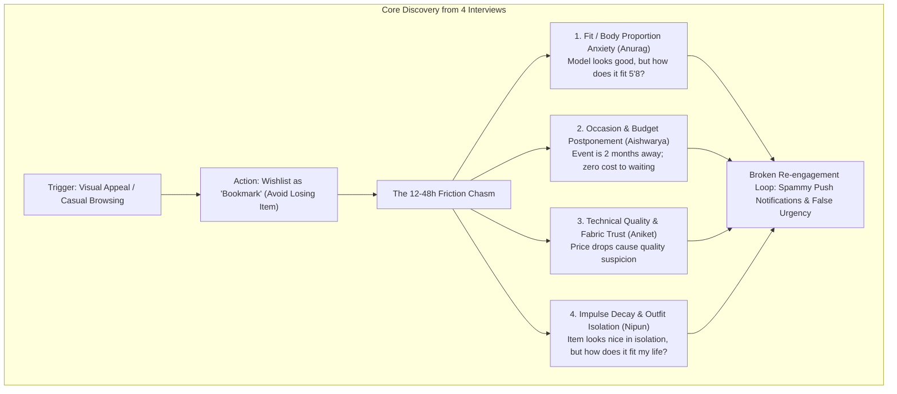

# Myntra Primary Research: User Interview Transcripts (N = 4)

**Project:** Myntra Wishlist → Purchase Conversion (NextLeap APM)  
**Methodology:** 10–15 Minute Semi-Structured Qualitative In-Depth Phone/Zoom Interviews  
**Study Scope:** Understanding user intent, friction points, hesitation psychology, and behavioral triggers between saving an item to Myntra Wishlist and not checking out within 30 days.  
**Constraint:** Zero monetary discount incentives.

---

## Participant Overview

| # | Name | Age | City | Occupation | Phone | Wishlist Item Context | Primary Barrier |
|---|---|---|---|---|---|---|---|
| **1** | **Aishwarya** | 30 | Bangalore | Developer | `9420070570` | Ethnic Kurta Set (~₹1,699) | Occasion-dependent / Budget prioritization |
| **2** | **Anurag** | 26 | Pune | Platform Engineer | `8956692566` | Slim-fit Formal Blazer/Shirt (~₹1,899) | Size/Fit uncertainty + Price hike friction |
| **3** | **Aniket** | 27 | Pune | Nutritionist / Gym Guide | `8459197091` | Training Shoes / Gym Apparel (~₹1,499) | Perceived value vs quality / Price drop hesitation |
| **4** | **Nipun** | 24 | Bangalore | Developer | `8273392965` | Casual Oversized Jacket (~₹1,799) | "Wish vs Need" deliberation / Impulse decay |

---

# Interview 1: Aishwarya

- **Participant:** Aishwarya (Age: 30)
- **Occupation:** Software Developer
- **Location:** Bangalore
- **Contact:** `9420070570`
- **Interview Mode:** Telephonic
- **Date & Time:** Friday, September 4, 2026 | 7:15 PM IST
- **Interviewer:** Amar (Product Lead)

### Participant Background & Shopping Habits
Aishwarya is a senior frontend engineer based in Whitefield, Bangalore. She shops online 2–3 times a month, predominantly using Myntra for ethnic wear, work formals, and footwear. She maintains an active wishlist of 40+ items.

---

### Transcript

**Interviewer [00:00]:** Hi Aishwarya, thanks so much for taking 10 minutes out on a Friday evening! How are you doing?

**Aishwarya [00:07]:** Hey Amar! I'm good, just logged off from work. Happy to chat.

**Interviewer [00:12]:** Awesome. In the quick survey you mentioned you saved an item on Myntra priced between ₹1,000 to ₹2,000 that you haven't bought yet. Can you tell me a bit about what that item is and how you found it?

**Aishwarya [00:27]:** Yeah, so it’s an embroidered Anarkali kurta set from Libas. I think it was around ₹1,699 or ₹1,750 when I saved it. Basically, one of my cousins is getting married in November, and during my lunch break two weeks back, I was just scrolling through Myntra's ethnic section to find something nice.

**Interviewer [00:48]:** Got it. And when you hit that heart icon, what was the thought in your head? Were you ready to buy right then?

**Aishwarya [00:56]:** Honestly, no. I really liked the color and styling, but November is still two months away. In my mind, I thought, *"Why spend ₹1,700 right now when I don't need it this week?"* Plus, I know Myntra has festive sales like Big Fashion Festival coming up around September-October. So the wishlist is basically my bookmark folder. If I don't heart it, I will lose it completely in their catalog.

**Interviewer [01:25]:** That makes complete sense. Between the day you saved it and today, did you revisit the item? Did Myntra send you any alerts?

**Aishwarya [01:34]:** Yeah, I opened the wishlist maybe twice over the weekend when I was showing options to my sister. Regarding notifications, I get a ton of push notifications from Myntra every day—like 4 to 5 generic ones: *"Hey Aishwarya, flat 70% off on handbags"* or *"Celebrity style picks"*. Honestly, I just swipe them away without reading because they feel like spam. I think there was one notification saying an item in my bag or wishlist was selling fast, but when I opened the app, it wasn't urgent at all. The size was still available.

**Interviewer [02:14]:** Interesting! So the notification felt like false urgency?

**Aishwarya [02:18]:** Exactly! It said "Selling Fast", but all sizes (S, M, L, XL) were in stock. So after that, you stop trusting those banners.

**Interviewer [02:28]:** If Myntra didn't offer any extra monetary discount or price drop, what would actually convince you to complete the checkout before November?

**Aishwarya [02:39]:** Hmm, couple of things. First, styling clarity. Often you buy an Anarkali and realize you don't know what dupatta or footwear goes with it, or how the fabric drapes on someone who is 5'3". If Myntra showed me how real customers styled it or recommended exact matching accessories already in my wardrobe, that builds confidence. Second, if there was a guaranteed delivery or size lock feature—like *"Reserve this piece for your occasion date"*—I wouldn’t postpone it. Right now, I postpone because there's no consequence to waiting.

**Interviewer [03:20]:** That’s super insightful, Aishwarya. Thanks a ton for sharing your raw experience!

**Aishwarya [03:26]:** Anytime, Amar! Best of luck with the project.

---

# Interview 2: Anurag

- **Participant:** Anurag (Age: 26)
- **Occupation:** Platform Engineer
- **Location:** Pune
- **Contact:** `8956692566`
- **Interview Mode:** Google Meet
- **Date & Time:** Saturday, September 5, 2026 | 11:30 AM IST
- **Interviewer:** Amar (Product Lead)

### Participant Background & Shopping Habits
Anurag works at a cloud tech startup in Hinjewadi, Pune. He shops online about once a month. He prefers tailored and slim-fit apparel but is hesitant about online sizing inconsistencies across different brands.

---

### Transcript

**Interviewer [00:00]:** Hey Anurag, thanks for jumping on the call this morning.

**Anurag [00:04]:** Hey Amar, good morning! No problem at all.

**Interviewer [00:08]:** Great. You mentioned in the survey that you had a wishlisted item in the ₹1,000–₹1,999 range where fit was the biggest blocker. What was the exact item?

**Anurag [00:19]:** It’s a structured linen blend blazer-style casual shirt from Roadster or Highlander, priced at around ₹1,499. I wanted something smart-casual for office demo days and evening dinners.

**Interviewer [00:32]:** What made you save it instead of hitting "Add to Bag" and checking out?

**Anurag [00:37]:** Size anxiety, 100%. I have broader shoulders, but a narrower waist. In Zara or H&M, I’m an L, but in Indian brands like Roadster, sometimes L fits like a tent around the stomach, and M is too tight on the chest. On the Myntra product page, the model is 6'1" wearing Size M. That tells me almost nothing about how it fits on an average Indian build of 5'8".

**Interviewer [01:05]:** Did you check the size chart or the customer reviews?

**Anurag [01:10]:** I did! The size chart is just generic chest and length numbers in inches. It doesn't tell me whether the fabric has stretch or if it shrinks after one wash. Then I scrolled down to reviews—half of the reviews just say *"Good color"* or *"Fast delivery"*. There were hardly any photos of people with my body proportions wearing it. So I actually went to Amazon and Ajio to see if the same shirt had better customer review photos.

**Interviewer [01:38]:** And what happened after you saved it? Did you notice the price change?

**Anurag [01:43]:** Yes! That was the most frustrating part. Two days later, I reopened the app thinking maybe I’ll order both M and L and return one. But the price had jumped from ₹1,499 to ₹1,749! That immediately triggered psychological resistance. I was like, *"I saw this at ₹1,499 48 hours ago; there's no way I'm paying ₹250 extra for the exact same shirt."* So it’s still sitting in my wishlist.

**Interviewer [02:12]:** If Myntra cannot drop the price, what feature or experience would give you the push to buy it today?

**Anurag [02:22]:** Honest fit intelligence. If Myntra told me: *"Users with your height and weight (5'8", 74 kg) who bought this shirt kept Size M 85% of the time,"* or showed a side-by-side fit comparison with a brand I already own (like my Levi’s shirts), I would have bought it immediately. Also, the exchange process—even though returns are available, having delivery agents come for pickups in a gated society during office hours is a headache. If they can de-risk the fit *before* ordering, checkout is seamless.

**Interviewer [03:01]:** That hits right at the core of the problem. Thanks for being so transparent, Anurag.

**Anurag [03:07]:** Glad I could help!

---

# Interview 3: Aniket

- **Participant:** Aniket (Age: 27)
- **Occupation:** Nutritionist & Fitness Consultant
- **Location:** Pune (Kothrud)
- **Contact:** `8459197091`
- **Interview Mode:** Telephonic
- **Date & Time:** Saturday, September 5, 2026 | 3:30 PM IST
- **Interviewer:** Amar (Product Lead)

### Participant Background & Shopping Habits
Aniket shops 2–3 times a month for gym activewear, training sneakers, and athleisure. He evaluates product quality strictly based on material durability (sweat-wicking, seams, fabric breathability).

---

### Transcript

**Interviewer [00:00]:** Hi Aniket, good afternoon! Thanks for speaking with me today.

**Aniket [00:05]:** Hey Amar, good afternoon. Yes, tell me.

**Interviewer [00:09]:** In our survey, you noted that you saved an item around ₹1,000–₹2,000 where price vs. perceived quality was a big consideration. Can you walk me through that item?

**Aniket [00:20]:** Yes, it’s a pair of HRX compression training tights with dry-fit fabric, around ₹1,299. Being a trainer, I wear athletic gear 8 to 10 hours a day.

**Interviewer [00:32]:** You wrote in the survey that the price actually went down after you saved it, but you still haven’t pulled the trigger. Why?

**Aniket [00:41]:** Yeah! It dropped by about ₹150, down to ₹1,149. But here is the thing: when the price dropped, I started doubting the material quality. For ₹1,100, is the fabric going to become see-through when squatting? Is the waistband going to lose elasticity after two washes? On Myntra, the description just says *"Polyester blend, dry fit"*. It doesn't specify GSM thickness or whether it's 4-way stretch.

**Interviewer [01:14]:** Did you check other apps or tools?

**Aniket [01:17]:** Yes, I checked Decathlon and Amazon. Decathlon actually specifies the technical details of the fabric and user testing in gyms. On Myntra, it’s heavily geared towards fashion and glamor shots of Hrithik Roshan, rather than functional product proof.

**Interviewer [01:36]:** Did you receive a notification when the price dropped?

**Aniket [01:40]:** Yes, I saw a push notification saying *"Price dropped on an item in your Wishlist!"* But by the time I tapped it and opened the app, it landed me on the generic homepage, not the product page! I had to manually navigate to Profile $\rightarrow$ Wishlist to find the item. By that time, the momentum was broken.

**Interviewer [02:04]:** That’s a massive friction point. Deep-linking broken. Beyond fixing the navigation, what non-monetary feature would make you click "Buy Now"?

**Aniket [02:14]:** Authentic verification badges or video clips of the fabric under stress. If I can see a 5-second customer clip showing how the fabric stretches or a verified badge for *"Squat-proof / Gym-tested"*, I don't care about a ₹100 discount. I will buy it because fitness gear is an investment in my daily comfort.

**Interviewer [02:41]:** That is golden feedback, Aniket. Appreciate your time and practical insight.

**Aniket [02:46]:** Cheers Amar, happy to contribute!

---

# Interview 4: Nipun

- **Participant:** Nipun (Age: 24)
- **Occupation:** Software Developer
- **Location:** Bangalore (Koramangala)
- **Contact:** `8273392965`
- **Interview Mode:** Telephonic
- **Date & Time:** Friday, September 4, 2026 | 8:00 PM IST
- **Interviewer:** Amar (Product Lead)

### Participant Background & Shopping Habits
Nipun is an active digital shopper who shops about once a month. He often browses Myntra casually on his phone while unwinding at night. His wishlist acts as an aspirational "graveyard" of cool clothes he finds interesting in the moment.

---

### Transcript

**Interviewer [00:00]:** Hey Nipun, thanks so much for making time after work.

**Nipun [00:05]:** Hey Amar, no worries man.

**Interviewer [00:09]:** Nipun, in your survey response you left an interesting comment: *"It wasn't something that was necessary, more of a wish, so was waiting to see if there are any changes."* Can you describe what that item was?

**Nipun [00:23]:** Haha, yeah. It was a denim varsity jacket from Mast & Harbour, around ₹1,799. I was just scrolling through Myntra in bed around 11 PM on a Wednesday. The jacket looked super stylish on the model. I tapped the heart icon just to save it because I liked the vibe.

**Interviewer [00:46]:** And what happened the next morning?

**Nipun [00:49]:** Next morning I woke up, got busy with morning standup and PR reviews, and completely forgot about it. When you look at it with a fresh mind in daylight, you think: *"Do I really need a heavy denim jacket in Bangalore weather? I already have two hoodies."* So the emotional impulse that made me save it evaporated within 12 hours.

**Interviewer [01:14]:** Did Myntra do anything to remind you or re-engage that initial interest?

**Nipun [01:21]:** Honestly, nothing relevant. I got a notification saying *"Your wishlist misses you!"* with a heart emoji. That felt super generic. It didn't mention the jacket, didn't show me how to style it, and didn't tell me if stock was low. It just felt like marketing spam, so I cleared the notification drawer.

**Interviewer [01:46]:** Today, the item is still sitting in your wishlist. If Myntra cannot reduce the price, what would bridge that gap between "casual wish" and "checkout"?

**Anurag / Nipun [01:57]:** I think two things. One is **utility pairing**. If Myntra showed me: *"Here's how this jacket pairs with the black jeans and white sneakers you bought 3 months ago on Myntra,"* suddenly it’s not an unnecessary ₹1,800 expense—it’s an upgrade to an existing outfit I already wear. Second, **social validation**. If I could easily share a private 2-tap link with 2 of my flatmates to ask *"Cop or Drop?"* without them having to download anything, their quick green light would push me to check out immediately.

**Interviewer [02:37]:** That concept of "Capsule Wardrobe Pairing" and social validation is brilliant. Thanks so much, Nipun!

**Nipun [02:44]:** Most welcome, Amar! Hope it turns into a great feature on Myntra.

---

## Cross-Interview Pattern Synthesis

### Key Behavioral Insights for Next Phases:
1. **The "Bookmark" Mental Model**: Users don't use Wishlist as pre-checkout; they use it as an organizational catalog because they fear losing the item in Myntra's massive catalog.
2. **The False Urgency Backlash**: Generic "Selling Fast" notifications destroy user trust. Notifications must provide genuine, personalized utility.
3. **De-risking via Outfit Integration**: Users don't buy items in a vacuum. Connecting wishlisted items to prior purchases or relatable body-type photos dissolves the "Wish vs Need" hesitation.
